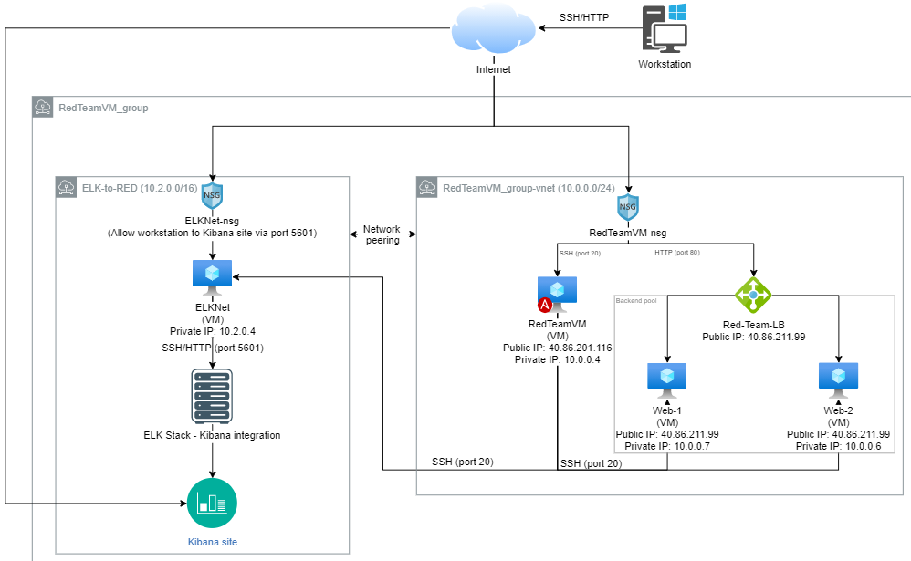
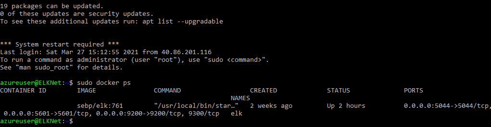

## Automated ELK Stack Deployment

The files in this repository were used to configure the network depicted below.



These files have been tested and used to generate a live ELK deployment on Azure. They can be used to either recreate the entire deployment pictured above. Alternatively, select portions of the Playbooks file may be used to install only certain pieces of it, such as Filebeat.

Playbook locations:

  - DVWA playbook: Ansible/Playbooks/DVWA Playbok/pentest.yml
  - Install ELK playbook: Ansible/Playbooks/install-elk.yml
  - Filebeat playbook: Ansible/Playbooks/filebeat-playbook.yml
  - Metricbeat playbook: Ansible/Playbooks/metricbeat-playbook.yml

This document contains the following details:

- Description of the Topology
- Access Policies
- ELK Configuration
  - Beats in Use
  - Machines Being Monitored
- How to Use the Ansible Build


### Description of the Topology

The main purpose of this network is to expose a load-balanced and monitored instance of DVWA, the D*mn Vulnerable Web Application.

Load balancing ensures that the application will be highly available, in addition to restricting access to the network.

- Load balancers protect the integrity and availability of this environment. The load balancers primary function is the ensure if one web application (Web-1) was targeted and/or compromised (by a DDoS attack for example) that additional applications (Web-2) would still be available to the consumer.

Integrating an ELK server allows users to easily monitor the vulnerable VMs for changes to the containers and system files.

- Filebeat integration allows the user to visualize an indexed collection of log files once opened in Kibana. This tool, in conjunction with ELK stack allows the user to have an overview of all log files as well as providing the option to filter the data by specific type of action.
- Metricbeat integration provides the user with an overview of services running on a server; it also collects data from the operating system. The end user can decide to see a broad array or a specific capture to understand more about the monitored environments.

The configuration details of each machine may be found below.

| Name                              | Function           | IP Address             | Operating System |
| --------------------------------- | ------------------ | ---------------------- | ---------------- |
| RedTeamVM                         | Gateway            | 40.86.201.116/10.0.0.4 | Linux            |
| Web-1                             | Server (VM)        | 10.0.0.7               | Linux            |
| Web-2                             | Server (VM)        | 10.0.0.6               | Linux            |
| ELKNet                            | Monitoring Service | 10.2.0.4               | Linux            |
| Red-Team-LB <br />(not a machine) | Load Balancer      | 40.86.211.99           | N/A              |

### Access Policies

The machines on the internal network are not exposed to the public Internet. 

Only the RedTeamVM machine can accept connections from the Internet. Access to this machine is only allowed from the following IP addresses:

- Workstation's IP address (The IP address of my home workstation)

Machines within the network can only be accessed by the JumpBox: RedTeamVM.

- The JumpBox machine is also able to access ELKNet VM as the two subnets are connected via network peering. The RedTeam-NSG rules allow the traffic from RedTeamVM to ELKNet and the connection (ssh) is effectively treated as internal traffic.

A summary of the access policies in place can be found in the table below.

| Name        | Publicly Accessible    | Allowed IP Addresses                                         |
| ----------- | ---------------------- | ------------------------------------------------------------ |
| RedTeamVM   | Yes                    | Home workstation IP address                                  |
| Web-1       | No                     | RedTeamVM - 10.0.0.4<br />ELKNet - 10.2.0.4                  |
| Web-2       | No                     | RedTeamVM - 10.0.0.4<br />ELKNet - 10.2.0.4                  |
| ELKNet      | Yes via Port 5601 ONLY | RedTeamVM - 10.0.0.4 <br />Home workstation IP address (via 5601) |
| Red-Team-LB | Yes                    | Home workstation IP address                                  |

### Elk Configuration

Ansible was used to automate configuration of the ELK machine. No configuration was performed manually, which is advantageous because...

- Automating configuration and deployment will save a lot of time when rolling out any number of webservers 
- Automation creates a uniform delivery of webservers, thus saving time when intricate changes must be made to specific number (or broad spectrum) of webservers
- Using ansible to automate configurations allows the user to roll out a setup process that is custom tailored to their organizational needs

A series of playbooks were used to configure and rollout the ELK machine. The following will list the function of each playbook and what it implements:

**pentest.yml playbook:**

- Disables apache2
- Installs docker, python 3 and python docker module (if not previously installed)
- Downloads and launches DVWA, ensures DVWA is always running on restart and only running on port 80.
- Enables docker service

**install-elk.yml playbook:**

- Installs docker, python 3 and python docker module (if not previously installed)
- Manually increases virtual memory availability
- Downloads and launches elk container via docker, ensures it is always running on reboot and runs on ports 5601, 9200, and 5044
- Enables docker service on boot

**filebeat-playbook.yml playbook:**

- Downloads and installs filebeat
- Drop in the filebeat configuration file that was created and stored in ../roles/
- Enable filebeat in system module and setup - configured to enable on boot

**metricbeat-playbook.yml playbook:**

- Download and installs metricbeat
- Drop in metricbeat configuration file that was created and stored in ../roles/
- Enable metricbeat in system module and setup - configured to enable on boot

The following screenshot displays the result of running `docker ps` after successfully configuring the ELK instance.



### Target Machines & Beats

This ELK server is configured to monitor the following machines:

- Web-2: 10.0.0.6
- Web-1: 10.0.0.7

We have installed the following Beats on these machines:

- Filebeat and Metricbeat

These Beats allow us to collect the following information from each machine:

- Filebeat allows all log files to be collected from each machine. In the event of an unprotected environment (ex. allowing traffic from any source on Port 22) you are able to see the ssh attempts from a variety of crawlers/scripts that would be able to locate the open port.
- Metricbeat would generate statistics/resources on the monitored machines. This data would showcase the resource usage and display it in a way that the user may understand how resources are being consumed. Example of this would be a resource-intensive program is running on Web-1, RAM usage would indicate that Web-1 is using far more RAM than Web-2 and thus the user can use Metricbeat to understand what resource-intensive program is running on Web-1 that is not running on Web-2 

### Using the Playbook

In order to use the playbook, you will need to have an Ansible control node already configured. Assuming you have such a control node provisioned: 

SSH into the control node (jumpbox) and follow the steps below:

- Copy the playbook files to /etc/ansible.
- Update the `hosts` file in /etc/ansible to include webservers and elk groups.

```
[webservers]
10.0.0.6 ansible_python_interpreter=/usr/bin/python3 ansible_ssh_private_key_file=/root/.ssh/id_rsa
10.0.0.7 ansible_python_interpreter=/usr/bin/python3 ansible_ssh_private_key_file=/root/.ssh/id_rsa

[elk]
10.2.0.4 ansible_python_interpreter=/usr/bin/python3 ansible_ssh_private_key_file=/root/.ssh/id_rsa
```

- In /etc/ansible/roles is `filebeat-config.yml`, within this file ensure lines 1106-1108 read as follows with your specific ELKVM Private IP:

```
  hosts: ["ELKVM Private IP:9200"]
  username: "elastic"
  password: "changeme"
```

- In /etc/ansible/roles is `filebeat-config.yml`, within this file ensure lines 1804-1805 read as follows with your specific ELKVM Private IP:

```
setup.kibana:
  host: "ELKVM Private IP:5601"
```

- In /etc/ansible/roles is `metricbeat-config.yml`, within this file ensure line 62 reads as follows with your specific ELKVM Private IP:

```
  host: "ELKVM Private IP:5601"
```

- In /etc/ansible/roles is `metricbeat-config.yml`, within this file ensure lines 93-102 read as follows with your specific ELKVM Private IP:

```
output.elasticsearch:
  # Array of hosts to connect to.
  hosts: ["ELKVM Private IP:9200"]
  username: "elastic"
  password: "changeme"

  # Optional protocol and basic auth credentials.
  #protocol: "https"
  #username: "elastic"
  #password: "changeme"
```

- By configuring the roles files and the host file this way, you will ensure that the ELK server is installed properly and that the metricbeat/filebeat are collecting data from the correct servers, outputting to Kibana dashboard. 
- Run the playbooks, and navigate to [ELKVM Public IP]:5601/app/kibana# to check that the installation worked as expected.

_As a **Bonus**, provide the specific commands the user will need to run to download the playbook, update the files, etc._
